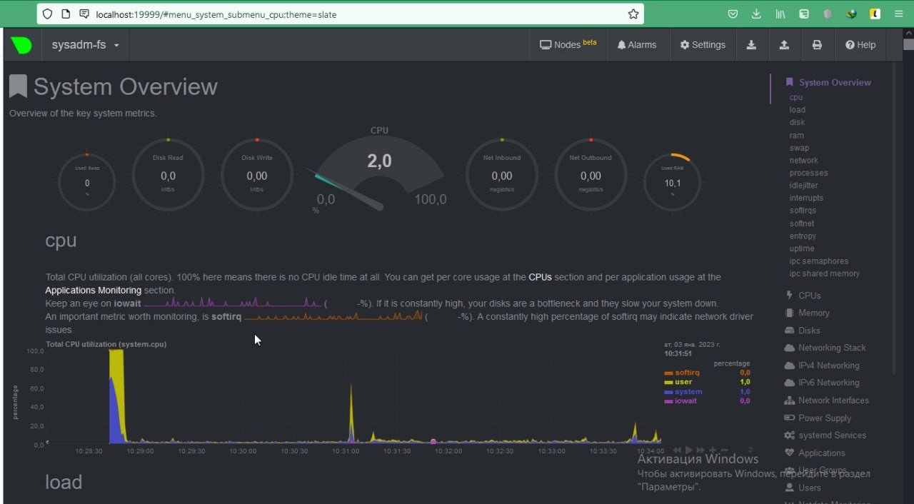

# Домашнее задание к занятию "3.4. Операционные системы. Лекция 2"

## Задание

1. На лекции мы познакомились с [node_exporter](https://github.com/prometheus/node_exporter/releases). В демонстрации его исполняемый файл запускался в background. Этого достаточно для демо, но не для настоящей production-системы, где процессы должны находиться под внешним управлением. Используя знания из лекции по systemd, создайте самостоятельно простой [unit-файл](https://www.freedesktop.org/software/systemd/man/systemd.service.html) для node_exporter:

    * поместите его в автозагрузку,
    * предусмотрите возможность добавления опций к запускаемому процессу через внешний файл (посмотрите, например, на `systemctl cat cron`),
    * удостоверьтесь, что с помощью systemctl процесс корректно стартует, завершается, а после перезагрузки автоматически поднимается.

созданный unit файл
sudo nano /etc/systemd/system/node_exporter.service
[Unit]
Description=Node Exporter
Wants=network-online.target
After=network-online.target

[Service]
User=node_exporter
Group=node_exporter
Type=simple
ExecStart=/usr/local/bin/node_exporter $EXTRA_OPTS
StandardOutput=file:/var/log/node_explorer.log
StandardError=file:/var/log/node_explorer.log

[Install]
WantedBy=multi-user.target

возможностьдобавление опций из файла $EXTRA_OPTS 
ExecStart=/usr/local/bin/node_exporter $EXTRA_OPTS

просмотр логов
journalctl -u node_exporter.service

2. Ознакомьтесь с опциями node_exporter и выводом `/metrics` по-умолчанию. Приведите несколько опций, которые вы бы выбрали для базового мониторинга хоста по CPU, памяти, диску и сети.
CPU
TYPE node_cpu_seconds_total counter
node_cpu_seconds_total{cpu="0",mode="idle"} 3536.95
node_cpu_seconds_total{cpu="0",mode="iowait"} 2.58
node_cpu_seconds_total{cpu="0",mode="irq"} 0
node_cpu_seconds_total{cpu="0",mode="nice"} 0
node_cpu_seconds_total{cpu="0",mode="softirq"} 1.87
node_cpu_seconds_total{cpu="0",mode="steal"} 0
node_cpu_seconds_total{cpu="0",mode="system"} 51.13
node_cpu_seconds_total{cpu="0",mode="user"} 42.1
node_cpu_seconds_total{cpu="1",mode="idle"} 3532.95
node_cpu_seconds_total{cpu="1",mode="iowait"} 1
node_cpu_seconds_total{cpu="1",mode="irq"} 0
node_cpu_seconds_total{cpu="1",mode="nice"} 0
node_cpu_seconds_total{cpu="1",mode="softirq"} 1.72
node_cpu_seconds_total{cpu="1",mode="steal"} 0
node_cpu_seconds_total{cpu="1",mode="system"} 51.3
node_cpu_seconds_total{cpu="1",mode="user"} 42.11

Memory
доступная память
# HELP node_memory_MemAvailable_bytes Memory information field MemAvailable_bytes.
# TYPE node_memory_MemAvailable_bytes gauge
node_memory_MemAvailable_bytes 1.699360768e+09

свободная память
# HELP node_memory_MemFree_bytes Memory information field MemFree_bytes.
# TYPE node_memory_MemFree_bytes gauge
node_memory_MemFree_bytes 1.080066048e+09

всего памяти
# HELP node_memory_MemTotal_bytes Memory information field MemTotal_bytes.
# TYPE node_memory_MemTotal_bytes gauge
node_memory_MemTotal_bytes 2.079461376e+09

DISK
доступное место на дисках( разделах)
TYPE node_filesystem_avail_bytes gauge
node_filesystem_avail_bytes{device="/dev/mapper/ubuntu--vg-ubuntu--lv",fstype="ext4",mountpoint="/"} 2.6989604864e+10
node_filesystem_avail_bytes{device="/dev/sda2",fstype="ext4",mountpoint="/boot"} 1.339236352e+09
node_filesystem_avail_bytes{device="tmpfs",fstype="tmpfs",mountpoint="/run"} 2.06921728e+08
node_filesystem_avail_bytes{device="tmpfs",fstype="tmpfs",mountpoint="/run/lock"} 5.24288e+06
node_filesystem_avail_bytes{device="tmpfs",fstype="tmpfs",mountpoint="/run/snapd/ns"} 2.06921728e+08
node_filesystem_avail_bytes{device="tmpfs",fstype="tmpfs",mountpoint="/run/user/1000"} 2.07945728e+08

диски( разделы) с которыми проблемы 0- проблем нет
TYPE node_filesystem_readonly gauge
node_filesystem_readonly{device="/dev/mapper/ubuntu--vg-ubuntu--lv",fstype="ext4",mountpoint="/"} 0
node_filesystem_readonly{device="/dev/sda2",fstype="ext4",mountpoint="/boot"} 0
node_filesystem_readonly{device="tmpfs",fstype="tmpfs",mountpoint="/run"} 0
node_filesystem_readonly{device="tmpfs",fstype="tmpfs",mountpoint="/run/lock"} 0
node_filesystem_readonly{device="tmpfs",fstype="tmpfs",mountpoint="/run/snapd/ns"} 0
node_filesystem_readonly{device="tmpfs",fstype="tmpfs",mountpoint="/run/user/1000"} 0

обьем всего доступного диска(раздела)
TYPE node_filesystem_size_bytes gauge
node_filesystem_size_bytes{device="/dev/mapper/ubuntu--vg-ubuntu--lv",fstype="ext4",mountpoint="/"} 3.2889438208e+10
node_filesystem_size_bytes{device="/dev/sda2",fstype="ext4",mountpoint="/boot"} 1.551745024e+09
node_filesystem_size_bytes{device="tmpfs",fstype="tmpfs",mountpoint="/run"} 2.07949824e+08
node_filesystem_size_bytes{device="tmpfs",fstype="tmpfs",mountpoint="/run/lock"} 5.24288e+06
node_filesystem_size_bytes{device="tmpfs",fstype="tmpfs",mountpoint="/run/snapd/ns"} 2.07949824e+08
node_filesystem_size_bytes{device="tmpfs",fstype="tmpfs",mountpoint="/run/user/1000"} 2.07945728e+08

NET
инфо по подключению адаптеров 
TYPE node_network_info gauge
node_network_info{address="00:00:00:00:00:00",broadcast="00:00:00:00:00:00",device="lo",duplex="",ifalias="",operstate="unknown"} 1
node_network_info{address="08:00:27:97:d8:36",broadcast="ff:ff:ff:ff:ff:ff",device="eth1",duplex="full",ifalias="",operstate="up"} 1
node_network_info{address="08:00:27:a2:6b:fd",broadcast="ff:ff:ff:ff:ff:ff",device="eth0",duplex="full",ifalias="",operstate="up"} 1

сколько принято в байтах
TYPE node_network_receive_bytes_total counter
node_network_receive_bytes_total{device="eth0"} 1.5914954e+07
node_network_receive_bytes_total{device="eth1"} 123428
node_network_receive_bytes_total{device="lo"} 27326

сколько отдано в байтах
TYPE node_network_transmit_bytes_total counter
node_network_transmit_bytes_total{device="eth0"} 344731
node_network_transmit_bytes_total{device="eth1"} 1.254769e+06
node_network_transmit_bytes_total{device="lo"} 27326

3. Установите в свою виртуальную машину [Netdata](https://github.com/netdata/netdata). Воспользуйтесь [готовыми пакетами](https://packagecloud.io/netdata/netdata/install) для установки (`sudo apt install -y netdata`). 
   
   После успешной установки:
    * в конфигурационном файле `/etc/netdata/netdata.conf` в секции [web] замените значение с localhost на `bind to = 0.0.0.0`,
    * добавьте в Vagrantfile проброс порта Netdata на свой локальный компьютер и сделайте `vagrant reload`:

    ```bash
    config.vm.network "forwarded_port", guest: 19999, host: 19999
    ```

    После успешной перезагрузки в браузере *на своем ПК* (не в виртуальной машине) вы должны суметь зайти на `localhost:19999`. Ознакомьтесь с метриками, которые по умолчанию собираются Netdata и с комментариями, которые даны к этим метрикам.


ознакомился
pic

4. Можно ли по выводу `dmesg` понять, осознает ли ОС, что загружена не на настоящем оборудовании, а на системе виртуализации?

нашел такое осознание=)
[    0.000000] DMI: innotek GmbH VirtualBox/VirtualBox, BIOS VirtualBox 12/01/2006
[    0.000000] Hypervisor detected: KVM

5. Как настроен sysctl `fs.nr_open` на системе по-умолчанию? Определите, что означает этот параметр. Какой другой существующий лимит не позволит достичь такого числа (`ulimit --help`)?

vagrant@sysadm-fs:~$ sysctl fs.nr_open
fs.nr_open = 1048576
это показатель лимита на количество открытых дискрипторов файлов

ulimit --help
есть Soft resours limit  (програмный)
есть Hard resoure limit  (по возможностям железа)

ulimit -Sn
1024

ulimit -Hn
1048576

получаеться, Soft мы можем менять как в большую так и в меньшию сторону( но видимо не более значения fs.nr_open и Hard)
Hard только получается вниз, поскольку возможности железа у нас ограничены и также это равно значению fs.nr_open

6. Запустите любой долгоживущий процесс (не `ls`, который отработает мгновенно, а, например, `sleep 1h`) в отдельном неймспейсе процессов; покажите, что ваш процесс работает под PID 1 через `nsenter`. Для простоты работайте в данном задании под root (`sudo -i`). Под обычным пользователем требуются дополнительные опции (`--map-root-user`) и т.д.

vagrant@sysadm-fs:~$ ps -e | grep sleep
   1892 pts/0    00:00:00 sleep

 sudo nsenter --target 1892 --mount --uts --ipc --net --pid ps aux
USER         PID %CPU %MEM    VSZ   RSS TTY      STAT START   TIME COMMAND
root           1  0.0  0.0   5476   580 pts/0    S+   09:09   0:00 sleep 1h
root           2  0.0  0.1   8888  3336 pts/1    R+   09:33   0:00 ps aux

7. Найдите информацию о том, что такое `:(){ :|:& };:`. Запустите эту команду в своей виртуальной машине Vagrant с Ubuntu 20.04 (**это важно, поведение в других ОС не проверялось**). Некоторое время все будет "плохо", после чего (минуты) – ОС должна стабилизироваться. Вызов `dmesg` расскажет, какой механизм помог автоматической стабилизации. 
Как настроен этот механизм по-умолчанию, и как изменить число процессов, которое можно создать в сессии.

это fork бомба
создает процессы , а те в свою очередь свои процессы

dmesg
[ 7629.456598] cgroup: fork rejected by pids controller in /user.slice/user-1000.slice/session-1.scope