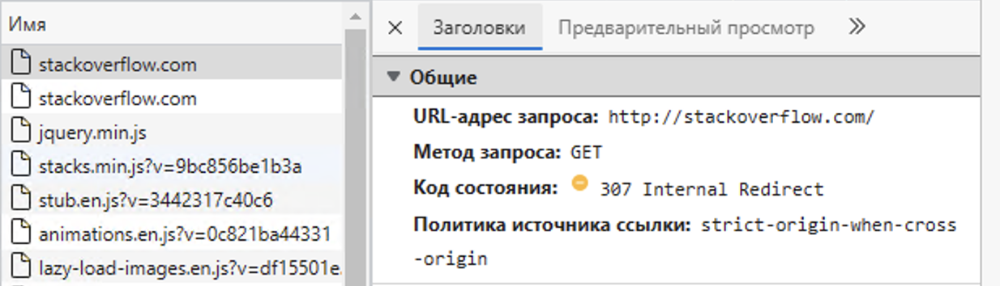
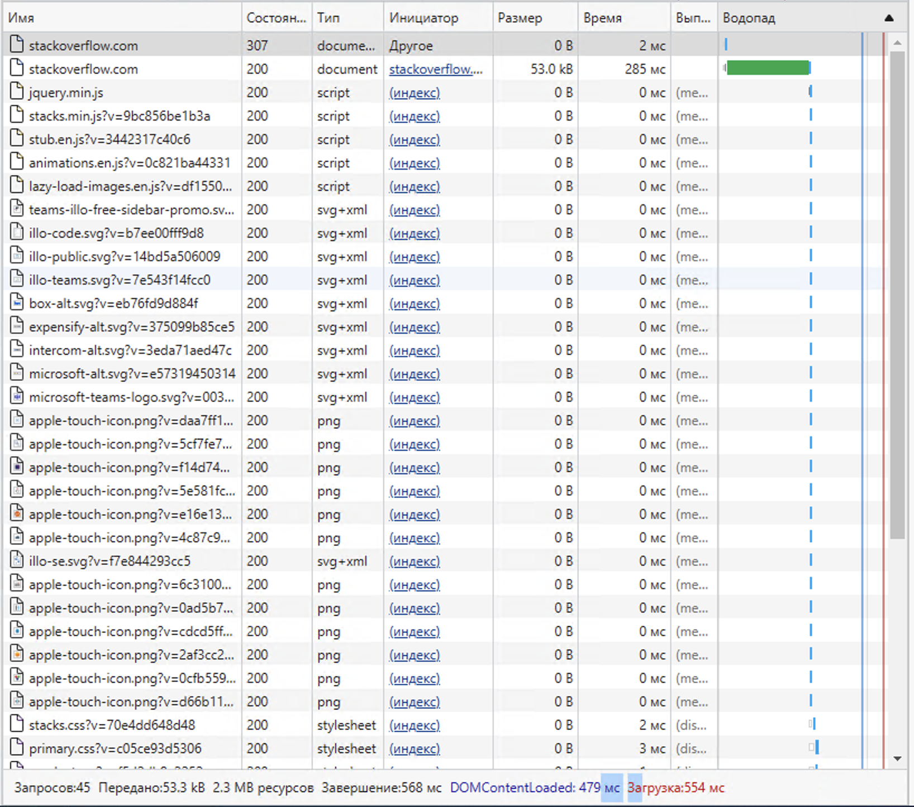
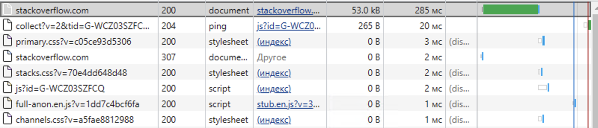

# Домашнее задание к занятию "3.6. Компьютерные сети. Лекция 1"

## Задание

1. Работа c HTTP через телнет.
- Подключитесь утилитой телнет к сайту stackoverflow.com
`telnet stackoverflow.com 80`
- Отправьте HTTP запрос
```bash
GET /questions HTTP/1.0
HOST: stackoverflow.com
[press enter]
[press enter]
```
*В ответе укажите полученный HTTP код, что он означает?*

HTTP/1.1 403 Forbidden
Connection: close
Content-Length: 1917
Server: Varnish
Retry-After: 0
Content-Type: text/html
Accept-Ranges: bytes
Date: Fri, 16 Dec 2022 19:44:35 GMT
Via: 1.1 varnish
X-Served-By: cache-fra-eddf8230059-FRA
X-Cache: MISS
X-Cache-Hits: 0
X-Timer: S1671219875.173803,VS0,VE3
X-DNS-Prefetch-Control: off

сервер прислал код 403 - означает что доступ к запрошенному ресурсу запрещен


2. Повторите задание 1 в браузере, используя консоль разработчика F12.
- откройте вкладку `Network`
- отправьте запрос http://stackoverflow.com
- найдите первый ответ HTTP сервера, откройте вкладку `Headers`
- укажите в ответе полученный HTTP код
- проверьте время загрузки страницы, какой запрос обрабатывался дольше всего?
- приложите скриншот консоли браузера в ответ.

первый ответ, и полученный HTTP код 307 
время загрузки страницы 554мс (http2) 
самый долгий запрос 285мс 

3. Какой IP адрес у вас в интернете?

через сайт whoer.net - 79.139.250.124 

4. Какому провайдеру принадлежит ваш IP адрес? Какой автономной системе AS? Воспользуйтесь утилитой `whois`

whois 79.139.250.124
descr:          Moscow Local Telephone Network (OAO MGTS)
origin:         AS25513

5. Через какие сети проходит пакет, отправленный с вашего компьютера на адрес 8.8.8.8? Через какие AS? Воспользуйтесь утилитой `traceroute`

идет через AS4637/AS48209, AS12695, AS15169

traceroute -nA 8.8.8.8
traceroute to 8.8.8.8 (8.8.8.8), 30 hops max, 60 byte packets
 1  *.*.*.* [*]  0.312 ms  0.277 ms  0.308 ms
 2  *.*.*.1 [AS4637/AS48209]  0.893 ms  0.913 ms  0.936 ms
 3  *.*.*.13 [AS48209]  0.946 ms  0.966 ms  0.924 ms
 4  *.*.*.65 [AS4637/AS48209]  0.953 ms  0.917 ms  0.904 ms
 5  89.208.23.233 [AS12695]  1.359 ms  1.338 ms  1.530 ms
 6  89.208.23.215 [AS12695]  2.122 ms  2.476 ms  2.182 ms
 7  * * *
 8  108.170.250.33 [AS15169]  2.596 ms 108.170.250.129 [AS15169]  2.432 ms 108.170.226.90 [AS15169]  1.929 ms
 9  108.170.250.51 [AS15169]  2.060 ms 108.170.250.113 [AS15169]  2.538 ms 108.170.250.51 [AS15169]  1.957 ms
10  142.251.78.106 [AS15169]  17.570 ms 142.250.238.214 [AS15169]  17.479 ms 216.239.51.32 [AS15169]  19.271 ms
11  142.250.235.68 [AS15169]  19.051 ms 72.14.235.69 [AS15169]  15.731 ms 142.251.238.66 [AS15169]  17.193 ms
12  216.239.58.69 [AS15169]  18.890 ms 74.125.253.147 [AS15169]  19.683 ms 172.253.79.115 [AS15169]  16.893 ms
13  * * *
14  * * *
15  * * *
16  * * *
17  * * *
18  * * *
19  * * *
20  * * *
21  * * *
22  8.8.8.8 [AS15169]  18.649 ms *  16.804 ms

6. Повторите задание 5 в утилите `mtr`. На каком участке наибольшая задержка - delay?
Start: 2022-12-17T13:36:33+0300
HOST: vit-virtual-machine         Loss%   Snt   Last   Avg  Best  Wrst StDev
  1. AS???    192.168.77.1         0.0%     1    0.5   0.5   0.5   0.5   0.0
  2. AS48209  217.79.230.1         0.0%     1    1.2   1.2   1.2   1.2   0.0
  3. AS48209  217.79.225.13        0.0%     1    1.2   1.2   1.2   1.2   0.0
  4. AS48209  217.79.226.65        0.0%     1    1.2   1.2   1.2   1.2   0.0
  5. AS12695  89.208.23.233        0.0%     1    1.5   1.5   1.5   1.5   0.0
  6. AS12695  89.208.23.215        0.0%     1    2.4   2.4   2.4   2.4   0.0
  7. AS15169  108.170.250.129      0.0%     1    2.7   2.7   2.7   2.7   0.0
  8. AS15169  108.170.250.146      0.0%     1    1.9   1.9   1.9   1.9   0.0
  9. AS15169  142.251.237.156      0.0%     1   14.5  14.5  14.5  14.5   0.0
 10. AS15169  142.251.237.148      0.0%     1   17.9  17.9  17.9  17.9   0.0
 11. AS15169  216.239.40.61        0.0%     1   16.3  16.3  16.3  16.3   0.0
 12. AS???    ???                 100.0     1    0.0   0.0   0.0   0.0   0.0
 13. AS???    ???                 100.0     1    0.0   0.0   0.0   0.0   0.0
 14. AS???    ???                 100.0     1    0.0   0.0   0.0   0.0   0.0
 15. AS???    ???                 100.0     1    0.0   0.0   0.0   0.0   0.0
 16. AS???    ???                 100.0     1    0.0   0.0   0.0   0.0   0.0
 17. AS???    ???                 100.0     1    0.0   0.0   0.0   0.0   0.0
 18. AS???    ???                 100.0     1    0.0   0.0   0.0   0.0   0.0
 19. AS???    ???                 100.0     1    0.0   0.0   0.0   0.0   0.0
 20. AS???    ???                 100.0     1    0.0   0.0   0.0   0.0   0.0
 21. AS15169  8.8.8.8              0.0%     1   14.8  14.8  14.8  14.8   0.0

самая большая задержка на 10 шаге

7. Какие DNS сервера отвечают за доменное имя dns.google? Какие A записи? Воспользуйтесь утилитой `dig`

dns записи
dig NS +short dns.google
ns3.zdns.google.
ns1.zdns.google.
ns2.zdns.google.
ns4.zdns.google.

запись А
dig A +short dns.google
8.8.4.4
8.8.8.8

8. Проверьте PTR записи для IP адресов из задания 7. Какое доменное имя привязано к IP? Воспользуйтесь утилитой `dig`

;; ANSWER SECTION:
8.8.8.8.in-addr.arpa.	17625	IN	PTR	dns.google.

;; ANSWER SECTION:
4.4.8.8.in-addr.arpa.	16484	IN	PTR	dns.google.