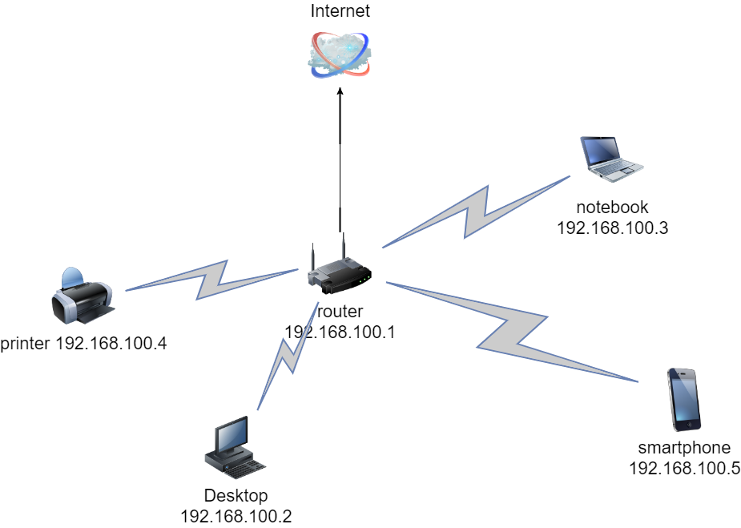

# Домашнее задание к занятию "3.8. Компьютерные сети, лекция 3"

## Задание

1. Подключитесь к публичному маршрутизатору в интернет. Найдите маршрут к вашему публичному IP
```
telnet route-views.routeviews.org
Username: rviews
show ip route x.x.x.x/32
show bgp x.x.x.x/32
```


Routing entry for 81.177.x.x/23
  Known via "bgp 6447", distance 20, metric 0
  Tag 3303, type external
  Last update from 217.192.89.50 2w2d ago
  Routing Descriptor Blocks:
  * 217.192.89.50, from 217.192.89.50, 2w2d ago
      Route metric is 0, traffic share count is 1
      AS Hops 2
      Route tag 3303
      MPLS label: none


BGP routing table entry for 81.177.x.x/23, version 2557582400
Paths: (22 available, best #21, table default)
  Not advertised to any peer
  Refresh Epoch 1
  3333 1103 12389
    193.0.0.56 from 193.0.0.56 (193.0.0.56)
      Origin IGP, localpref 100, valid, external
      path 7FE12AC4D2B0 RPKI State valid
      rx pathid: 0, tx pathid: 0
  Refresh Epoch 1
  3267 12389
    194.85.40.15 from 194.85.40.15 (185.141.126.1)
      Origin IGP, metric 0, localpref 100, valid, external
      path 7FE1135AB1F0 RPKI State valid
      rx pathid: 0, tx pathid: 0
  Refresh Epoch 1
  7018 3356 12389
    12.0.1.63 from 12.0.1.63 (12.0.1.63)
      Origin IGP, localpref 100, valid, external
      Community: 7018:5000 7018:37232
      path 7FE16C37A068 RPKI State valid
      rx pathid: 0, tx pathid: 0
  Refresh Epoch 1

2. Создайте dummy0 интерфейс в Ubuntu. Добавьте несколько статических маршрутов. Проверьте таблицу маршрутизации.
ip r | grep static
10.0.4.0/24 via 10.0.2.2 dev dummy0 proto static

3. Проверьте открытые TCP порты в Ubuntu, какие протоколы и приложения используют эти порты? Приведите несколько примеров.

➜  ~ ss -tnlp
State    Recv-Q   Send-Q     Local Address:Port     Peer Address:Port  Process
LISTEN   0        4096       127.0.0.53%lo:53            0.0.0.0:*
LISTEN   0        128              0.0.0.0:22            0.0.0.0:*
LISTEN   0        5              127.0.0.1:631           0.0.0.0:*
LISTEN   0        128                 [::]:22               [::]:*
LISTEN   0        5                  [::1]:631              [::]:*

22 ssh
53 dns

4. Проверьте используемые UDP сокеты в Ubuntu, какие протоколы и приложения используют эти порты?
 ss -unap
State   Recv-Q   Send-Q     Local Address:Port      Peer Address:Port  Process
UNCONN  0        0                0.0.0.0:631            0.0.0.0:*
UNCONN  0        0                0.0.0.0:39716          0.0.0.0:*
UNCONN  0        0                0.0.0.0:5353           0.0.0.0:*
UNCONN  0        0          127.0.0.53%lo:53             0.0.0.0:*
UNCONN  0        0                   [::]:5353              [::]:*
UNCONN  0        0                   [::]:47099             [::]:*

53 dns
5353 multicast dns
5. Используя diagrams.net, создайте L3 диаграмму вашей домашней сети или любой другой сети, с которой вы работали. 

