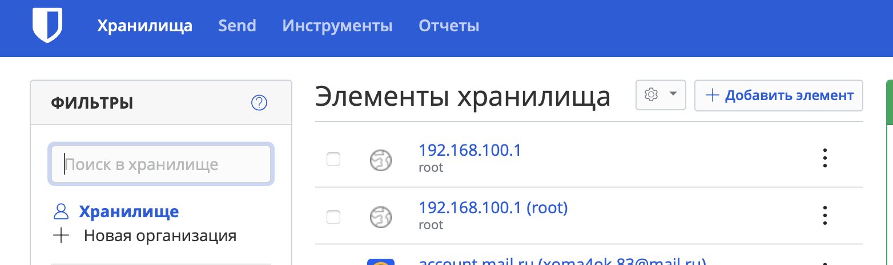
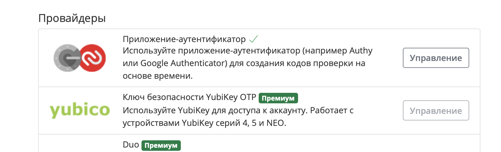
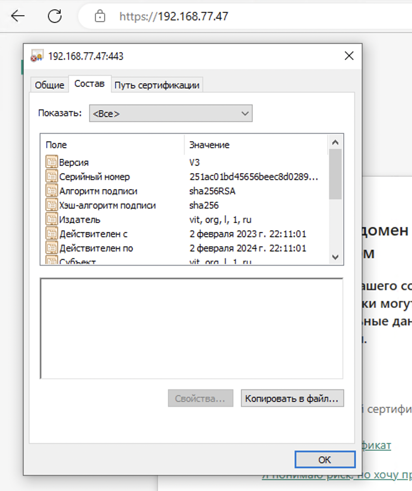
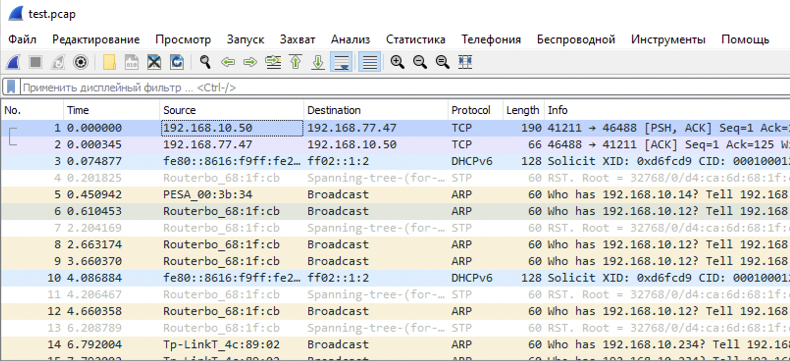

# Домашнее задание к занятию "3.9. Элементы безопасности информационных систем"

## Задание

1. Установите Bitwarden плагин для браузера. Зарегестрируйтесь и сохраните несколько паролей.

2. Установите Google authenticator на мобильный телефон. Настройте вход в Bitwarden акаунт через Google authenticator OTP.

3. Установите apache2, сгенерируйте самоподписанный сертификат, настройте тестовый сайт для работы по HTTPS.
установка и настройка есть в интернете, далее прописал пути к сертификатам, установил компоненты и перезапустил апач и скрин с сертификатом прикладываю

4. Проверьте на TLS уязвимости произвольный сайт в интернете (кроме сайтов МВД, ФСБ, МинОбр, НацБанк, РосКосмос, РосАтом, РосНАНО и любых госкомпаний, объектов КИИ, ВПК ... и тому подобное).

testssl.sh git:(3.1dev) ./testssl.sh -U --sneaky https://ya.ru

Further IP addresses:   2a02:6b8::2:242
 rDNS (87.250.250.242):  ya.ru.
 Service detected:       HTTP

 Testing vulnerabilities

 Heartbleed (CVE-2014-0160)                not vulnerable (OK), no heartbeat extension
 CCS (CVE-2014-0224)                       not vulnerable (OK)
 Ticketbleed (CVE-2016-9244), experiment.  not vulnerable (OK)
 ROBOT                                     not vulnerable (OK)
 Secure Renegotiation (RFC 5746)           supported (OK)
 Secure Client-Initiated Renegotiation     not vulnerable (OK)
 CRIME, TLS (CVE-2012-4929)                not vulnerable (OK)
 BREACH (CVE-2013-3587)                    potentially NOT ok, "br gzip deflate" HTTP compression detected. - only supplied "/" tested
                                           Can be ignored for static pages or if no secrets in the page
 POODLE, SSL (CVE-2014-3566)               not vulnerable (OK)
 TLS_FALLBACK_SCSV (RFC 7507)              Downgrade attack prevention supported (OK)
 SWEET32 (CVE-2016-2183, CVE-2016-6329)    not vulnerable (OK)
 FREAK (CVE-2015-0204)                     not vulnerable (OK)
 DROWN (CVE-2016-0800, CVE-2016-0703)      not vulnerable on this host and port (OK)
                                           make sure you don't use this certificate elsewhere with SSLv2 enabled services, see
                                           https://search.censys.io/search?resource=hosts&virtual_hosts=INCLUDE&q=68C56160382AD96C62E4392A124209B291A40846890AB7832E23101BCA739A85
 LOGJAM (CVE-2015-4000), experimental      not vulnerable (OK): no DH EXPORT ciphers, no DH key detected with <= TLS 1.2
 BEAST (CVE-2011-3389)                     TLS1: ECDHE-ECDSA-AES128-SHA
                                                 ECDHE-RSA-AES128-SHA
                                           VULNERABLE -- but also supports higher protocols  TLSv1.1 TLSv1.2 (likely mitigated)
 LUCKY13 (CVE-2013-0169), experimental     potentially VULNERABLE, uses cipher block chaining (CBC) ciphers with TLS. Check patches
 Winshock (CVE-2014-6321), experimental    not vulnerable (OK)
 RC4 (CVE-2013-2566, CVE-2015-2808)        no RC4 ciphers detected (OK)

 Done 2023-02-04 17:18:22 [0049s] -->> 87.250.250.242:443 (ya.ru) <<--

5. Установите на Ubuntu ssh сервер, сгенерируйте новый приватный ключ. Скопируйте свой публичный ключ на другой сервер. Подключитесь к серверу по SSH-ключу.
 
ssh-keygen
Generating public/private rsa key pair.
Enter file in which to save the key (/home/vit/.ssh/id_rsa):
Enter passphrase (empty for no passphrase):
Enter same passphrase again:
Your identification has been saved in /home/vit/.ssh/id_rsa
Your public key has been saved in /home/vit/.ssh/id_rsa.pub
The key fingerprint is:
SHA256:*****
The key's randomart image is:
+---[RSA 3072]----+
|**==....  ...o++.|
|BO*o.o.    .  ...|
|=+++ .+ o o     .|
|+ ..+o + + o   . |
|.+ .. o S o o .  |
|  E ..     o .   |
| . .      .      |
|                 |
|                 |
+----[SHA256]-----+

~ ssh-copy-id vitaliy@192.168.100.50 -p 42222
~ ssh vitaliy@192.168.100.50 -p 42222
Enter passphrase for key '/home/vit/.ssh/id_rsa':
Welcome to Ubuntu 16.04.7 LTS (GNU/Linux 4.4.0-210-generic x86_64)

6. Переименуйте файлы ключей из задания 5. Настройте файл конфигурации SSH клиента, так чтобы вход на удаленный сервер осуществлялся по имени сервера.

sudo mv ~/.ssh/id_rsa ~/.ssh/id_rsa_test
sudo nano ~/.ssh/config
Host ubuntu16
        HostName 192.168.100.50
        User vitaliy
        Port 42222
        IdentityFile ~/.ssh/id_rsa_netology
ssh ubuntu16
Enter passphrase for key '/home/vit/.ssh/id_rsa_nety':
Welcome to Ubuntu 16.04.7 LTS (GNU/Linux 4.4.0-210-generic x86_64)

7. Соберите дамп трафика утилитой tcpdump в формате pcap, 100 пакетов. Откройте файл pcap в Wireshark.

udo tcpdump -c 100 -w test.pcap -i eth1
tcpdump: listening on eth1, link-type EN10MB (Ethernet), capture size 262144 bytes
100 packets captured
100 packets received by filter
0 packets dropped by kernel
5 packets dropped by interface

