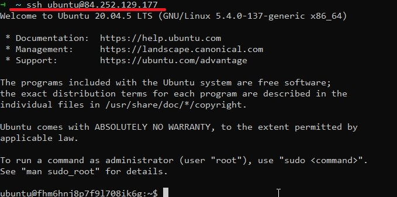
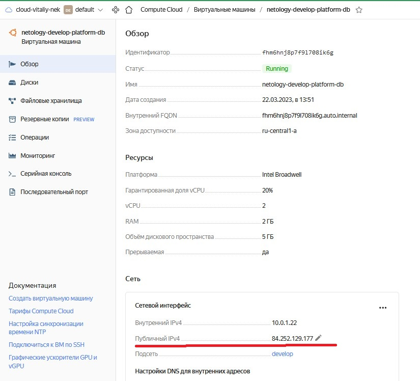

# Домашнее задание к занятию "Основы Terraform. Yandex Cloud"

### Цель задания

1. Создать свои ресурсы в облаке Yandex Cloud с помощью Terraform.
2. Освоить работу с переменными Terraform.

### Чеклист готовности к домашнему заданию

1. Зарегистрирован аккаунт в Yandex Cloud. Использован промокод на грант.
2. Установлен инструмент Yandex Cli.
3. Исходный код для выполнения задания расположен в директории [**02/src**](https://github.com/netology-code/ter-homeworks/tree/main/02/src).

### Задание 0

1. Ознакомьтесь с [документацией к security-groups в Yandex Cloud](https://cloud.yandex.ru/docs/vpc/concepts/security-groups?from=int-console-help-center-or-nav).
2. Запросите preview доступ к данному функционалу в ЛК Yandex Cloud. Обычно его выдают в течении 24-х часов.
https://console.cloud.yandex.ru/folders/<ваш cloud_id>/vpc/security-groups
Этот функционал понадобится к следующей лекции. 

- доступ 

### Задание 1

1. Изучите проект. В файле variables.tf объявлены переменные для yandex provider.
2. Переименуйте файл personal.auto.tfvars_example в personal.auto.tfvars. Заполните переменные (идентификаторы облака, токен доступа). Благодаря .gitignore этот файл не попадет в публичный репозиторий. **Вы можете выбрать иной способ безопасно передать секретные данные в terraform.**
3. Сгенерируйте или используйте свой текущий ssh ключ. Запишите его открытую часть в переменную **vms_ssh_root_key**.
4. Инициализируйте проект, выполните код. Исправьте возникшую ошибку. Ответьте в чем заключается ее суть?
5. Ответьте, что означает ```preemptible = true``` и ```core_fraction``` в параметрах ВМ? Как это может пригодится в процессе обучения? Ответ в документации Yandex cloud.

В качестве решения приложите:
- скриншот ЛК Yandex Cloud с созданной ВМ,
- скриншот успешного подключения к консоли ВМ через ssh,
- ответы на вопросы.

## Решение: 





```bash
1. ошибка заключалась в том, что указанное количество ядер 1 недоступно на платформе "standard-v1"; допустимое количество ядер: 2, 4
---
2. preemptible = true создает прерываемую машину
---
3. core_fraction = Базовый уровень производительности vCPU.
```

### Задание 2

1. Изучите файлы проекта.
2. Замените все "хардкод" **значения** для ресурсов **yandex_compute_image** и **yandex_compute_instance** на **отдельные** переменные. К названиям переменных ВМ добавьте в начало префикс **vm_web_** .  Пример: **vm_web_name**.
2. Объявите нужные переменные в файле variables.tf, обязательно указывайте тип переменной. Заполните их **default** прежними значениями из main.tf. 
3. Проверьте terraform plan (изменений быть не должно). 

- Решение:
[variables.tf](7.2-terraform/src/variables.tf)

### Задание 3

1. Создайте в корне проекта файл 'vms_platform.tf' . Перенесите в него все переменные ВМ.
2. Скопируйте блок ресурса и создайте с его помощью вторую ВМ: **"netology-develop-platform-db"** ,  cores  = 2, memory = 2, core_fraction = 20. Объявите ее переменные с префиксом **vm_db_** в том же файле.
3. Примените изменения.

- Решение: ссылкка на файлы [vms_platform.tf](7.2-terraform/src/vms_platform.tf) , [main.tf](7.2-terraform/src/main.tf)

### Задание 4

1. Объявите в файле outputs.tf отдельные output, для каждой из ВМ с ее внешним IP адресом.
2. Примените изменения.

В качестве решения приложите вывод значений ip-адресов команды ```terraform output```

- Решение: ссылкка на файл [outputs.tf](7.2-terraform/src/outputs.tf)
```bash
$ terraform output
db_ip_address = "158.160.33.200"
web_ip_address = "158.160.63.223"
```

### Задание 5

1. В файле locals.tf опишите в **одном** local-блоке имя каждой ВМ, используйте интерполяцию по примеру из лекции.
2. Замените переменные с именами ВМ из файла variables.tf на созданные вами local переменные.
3. Примените изменения.

- Решение: ссылкка на файлы [variables.tf](7.2-terraform/src/variables.tf) закоментировал vm_web_name,[vms_platform.tf](7.2-terraform/src/vms_platform.tf) закоментировал vm_db_name, использовал интерполяцию [main.tf](7.2-terraform/src/main.tf)

### Задание 6

1. Вместо использования 3-х переменных  ".._cores",".._memory",".._core_fraction" в блоке  resources {...}, объедените их в переменные типа **map** с именами "vm_web_resources" и "vm_db_resources".
2. Так же поступите с блоком **metadata {serial-port-enable, ssh-keys}**, эта переменная должна быть общая для всех ваших ВМ.
3. Найдите и удалите все более не используемые переменные проекта.
4. Проверьте terraform plan (изменений быть не должно).

------

## Дополнительные задания (со звездочкой*)

**Настоятельно рекомендуем выполнять все задания под звёздочкой.**   Их выполнение поможет глубже разобраться в материале.
Задания под звёздочкой дополнительные (необязательные к выполнению) и никак не повлияют на получение вами зачета по этому домашнему заданию.

### Задание 7*

Изучите сожержимое файла console.tf. Откройте terraform console, выполните следующие задания: 

1. Напишите, какой командой можно отобразить **второй** элемент списка test_list?
2. Найдите длину списка test_list с помощью функции length(<имя переменной>).
3. Напишите, какой командой можно отобразить значение ключа admin из map test_map ?
4. Напишите interpolation выражение, результатом которого будет: "John is admin for production server based on OS ubuntu-20-04 with X vcpu, Y ram and Z virtual disks", используйте данные из переменных test_list, test_map, servers и функцию length() для подстановки значений.

В качестве решения предоставьте необходимые команды и их вывод.

- Решение:
```bash
1. test_list[1] или local.test_list[1]
2. length("local.test_list[0,1,2]")
3. local.test_map.admin
4. ${ local.test_map.admin }" is "${}
```
------
### Правила приема работы

В git-репозитории, в котором было выполнено задание к занятию "Введение в Terraform", создайте новую ветку terraform-02, закомитьте в эту ветку свой финальный код проекта. Ответы на задания и необходимые скриншоты оформите в md-файле в ветке terraform-02.

В качестве результата прикрепите ссылку на ветку terraform-02 в вашем репозитории.

**ВАЖНО!Удалите все созданные ресурсы**.
