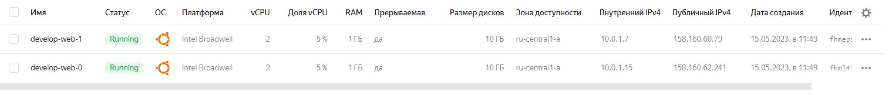

# Домашнее задание к занятию "Продвинутые методы работы с Terraform"

### Задание 1

1. Возьмите из [демонстрации к лекции готовый код](https://github.com/netology-code/ter-homeworks/tree/main/04/demonstration1) для создания ВМ с помощью remote модуля.
2. Создайте 1 ВМ, используя данный модуль. В файле cloud-init.yml необходимо использовать переменную для ssh ключа вместо хардкода. Передайте ssh-ключ в функцию template_file в блоке vars ={} .
Воспользуйтесь [**примером**](https://grantorchard.com/dynamic-cloudinit-content-with-terraform-file-templates/). Обратите внимание что ssh-authorized-keys принимает в себя список, а не строку!
3. Добавьте в файл cloud-init.yml установку nginx.
4. Предоставьте скриншот подключения к консоли и вывод команды ```sudo nginx -t```.


- Решение:
  
  

------

### Задание 2

1. Напишите локальный модуль vpc, который будет создавать 2 ресурса: **одну** сеть и **одну** подсеть в зоне, объявленной при вызове модуля. например: ```ru-central1-a```.
2. Модуль должен возвращать значения vpc.id и subnet.id
3. Замените ресурсы yandex_vpc_network и yandex_vpc_subnet, созданным модулем.
4. Сгенерируйте документацию к модулю с помощью terraform-docs.    
 
Пример вызова:
```
module "vpc_dev" {
  source       = "./vpc"
  env_name     = "develop"
  zone = "ru-central1-a"
  cidr = "10.0.1.0/24"
}
```

 Решение:
```
1. 
2. 
3. 
4. 
```

### Задание 3
1. Выведите список ресурсов в стейте.

2. Удалите из стейта модуль vpc.

3. Импортируйте его обратно. Проверьте terraform plan - изменений быть не должно.
Приложите список выполненных команд и вывод.

Решение:
```bash

➜  src git:(main) ✗ terraform state list
module.vpc.yandex_vpc_network.test_vpc
module.vpc.yandex_vpc_subnet.test_vpc_subnet["public-ru-central1-a"]
------
➜  src git:(main) ✗ terraform state rm module.vpc
Removed module.vpc.yandex_vpc_network.test_vpc
Removed module.vpc.yandex_vpc_subnet.test_vpc_subnet["public-ru-central1-a"]
Successfully removed 2 resource instance(s).
-----
➜  src git:(main) ✗ terraform import 'module.vpc.yandex_vpc_network.test_vpc' enpvsqbiak12qeb37i1a
module.vpc.yandex_vpc_network.test_vpc: Importing from ID "enpvsqbiak12qeb37i1a"...
module.vpc.yandex_vpc_network.test_vpc: Import prepared!
  Prepared yandex_vpc_network for import
module.vpc.yandex_vpc_network.test_vpc: Refreshing state... [id=enpvsqbiak12qeb37i1a]

Import successful!

The resources that were imported are shown above. These resources are now in
your Terraform state and will henceforth be managed by Terraform.

➜  src git:(main) ✗ terraform import 'module.vpc.yandex_vpc_subnet.test_vpc_subnet["public-ru-central1-a"]' e9bhblu40beb0jf61n2h
module.vpc.yandex_vpc_subnet.test_vpc_subnet["public-ru-central1-a"]: Importing from ID "e9bhblu40beb0jf61n2h"...
module.vpc.yandex_vpc_subnet.test_vpc_subnet["public-ru-central1-a"]: Import prepared!
  Prepared yandex_vpc_subnet for import
module.vpc.yandex_vpc_subnet.test_vpc_subnet["public-ru-central1-a"]: Refreshing state... [id=e9bhblu40beb0jf61n2h]

Import successful!

The resources that were imported are shown above. These resources are now in
your Terraform state and will henceforth be managed by Terraform.

➜  src git:(main) ✗ terraform plan
module.vpc.yandex_vpc_network.test_vpc: Refreshing state... [id=enpvsqbiak12qeb37i1a]
module.vpc.yandex_vpc_subnet.test_vpc_subnet["public-ru-central1-a"]: Refreshing state... [id=e9bhblu40beb0jf61n2h]

No changes. Your infrastructure matches the configuration.

Terraform has compared your real infrastructure against your configuration and found no
differences, so no changes are needed.
```

## Дополнительные задания (со звездочкой*)

**Настоятельно рекомендуем выполнять все задания под звёздочкой.**   Их выполнение поможет глубже разобраться в материале.   
Задания под звёздочкой дополнительные (необязательные к выполнению) и никак не повлияют на получение вами зачета по этому домашнему заданию. 


### Задание 4*

1. Измените модуль vpc так, чтобы он мог создать подсети во всех зонах доступности, переданных в переменной типа list(object) при вызове модуля.  
  
Пример вызова:
```
module "vpc_prod" {
  source       = "./vpc"
  env_name     = "production"
  subnets = [
    { zone = "ru-central1-a", cidr = "10.0.1.0/24" },
    { zone = "ru-central1-b", cidr = "10.0.2.0/24" },
    { zone = "ru-central1-c", cidr = "10.0.3.0/24" },
  ]
}

module "vpc_dev" {
  source       = "./vpc"
  env_name     = "develop"
  subnets = [
    { zone = "ru-central1-a", cidr = "10.0.1.0/24" },
  ]
}
```

Предоставьте код, план выполнения, результат из консоли YC.

### Задание 5**

1. Напишите модуль для создания кластера managed БД Mysql в Yandex Cloud с 1 или 3 хостами в зависимости от переменной HA=true или HA=false. Используйте ресурс yandex_mdb_mysql_cluster (передайте имя кластера и id сети).
2. Напишите модуль для создания базы данных и пользователя в уже существующем кластере managed БД Mysql. Используйте ресурсы yandex_mdb_mysql_database и yandex_mdb_mysql_user (передайте имя базы данных, имя пользователя и id кластера при вызове модуля).
3. Используя оба модуля, создайте кластер example из одного хоста, а затем добавьте в него БД test и пользователя app. Затем измените переменную и превратите сингл хост в кластер из 2х серверов.
4. 
Предоставьте план выполнения и по-возможности результат. Сразу же удаляйте созданные ресурсы, так как кластер может стоить очень дорого! Используйте минимальную конфигурацию.

### Задание 6***  

1. Разверните у себя локально vault, используя docker-compose.yml в проекте.
2. Для входа в web интерфейс и авторизации terraform в vault используйте токен "education"
3. Создайте новый секрет по пути http://127.0.0.1:8200/ui/vault/secrets/secret/create  
Path: example  
secret data key: test 
secret data value: congrats!  
4. Считайте данный секрет с помощью terraform и выведите его в output по примеру:
```
provider "vault" {
 address = "http://<IP_ADDRESS>:<PORT_NUMBER>"
 skip_tls_verify = true
 token = "education"
}
data "vault_generic_secret" "vault_example"{
 path = "secret/example"
}

output "vault_example" {
 value = "${nonsensitive(data.vault_generic_secret.vault_example.data)}"
} 

можно обратится не к словарю, а конкретному ключу.
terraform console: >nonsensitive(data.vault_generic_secret.vault_example.data.<имя ключа в секрете>)
```
5. Попробуйте разобраться в документации и записать новый секрет в vault с помощью terraform. 

