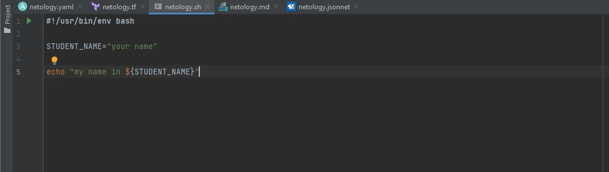
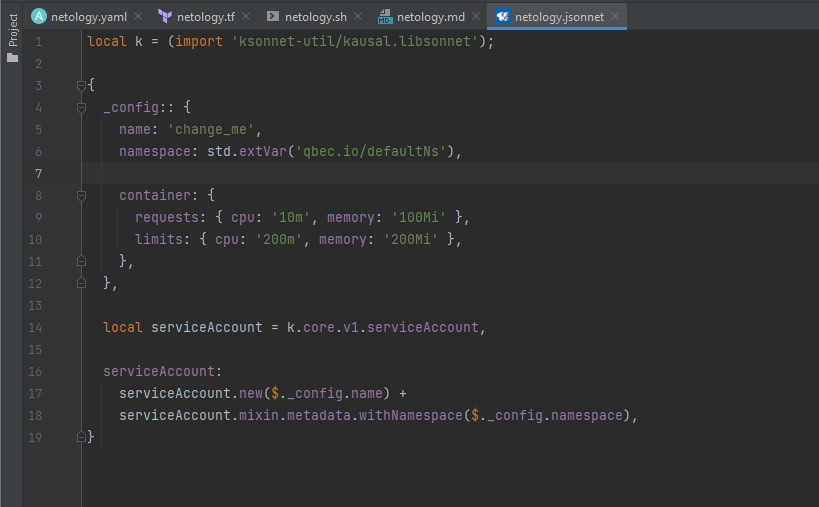
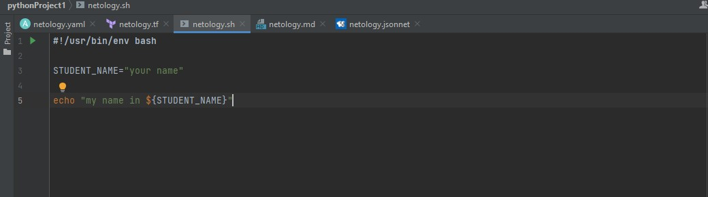
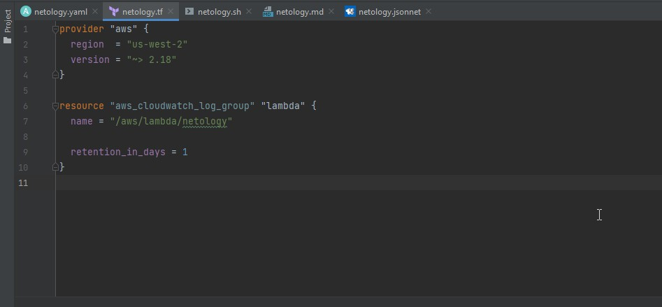
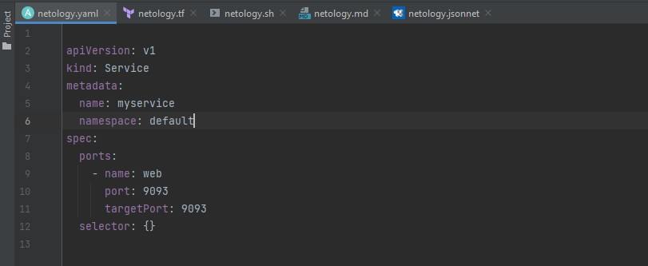

# Домашнее задание

## Задание 1. Подготовка рабочей среды

Скриншоты установленной IDE с плагинами:

Bash: 

Jsonnet: 

Markdown: 

Terraform: 

Yaml: 

## Задание 2. Описание жизненного цикла задачи (разработки нового функционала)

1. менеджеры планируют какие задачи надо решить
2. менеджеры создали пул задач на ближайший релиз и их приоритет
3. команде разработки и тестированию переданы все ТЗ
4. devops настраивает инфраструктуру для тестирования и разработки, и отказоустойчивости(бекапы)
5. начата работа Командой разработки в отдельных ветках
6. devops автоматизация сборки, тестирование и упаковки ПО, и мониторинг за этими процессами
7. devops создает среду Песочницу идентичную продуктивной 
8. тестировщики в песочнице тестируют ПО и все проходит успешно то:
9. Менеджеры после одобрения тестировщиками показывают готовую часть заказчику и получают обратную связь, или говорят об  передачи этого функционала ПО в продакшен
10. Если тестировщики рапортуют о багах или пробемах, то возвращают на доработку и возврат к шагу 3
11. После выпуска доработанного функционала в продукт, получение обратной связи и получение идей по улучшению или расширению функционалу и опять к планировке задач на релиз

end