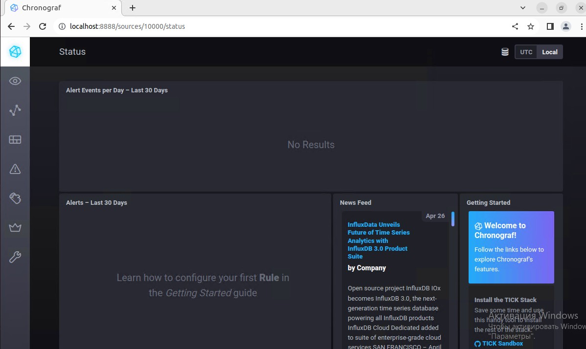
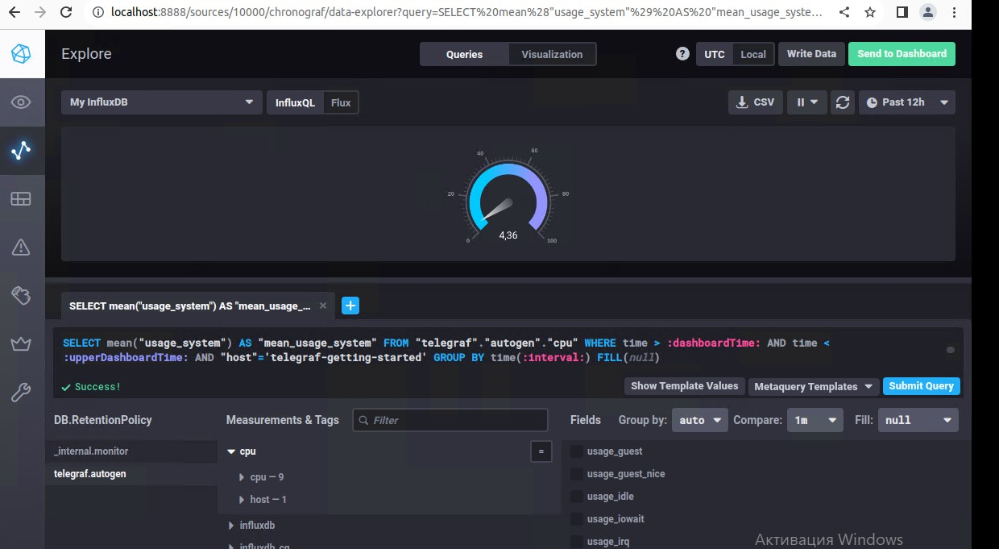
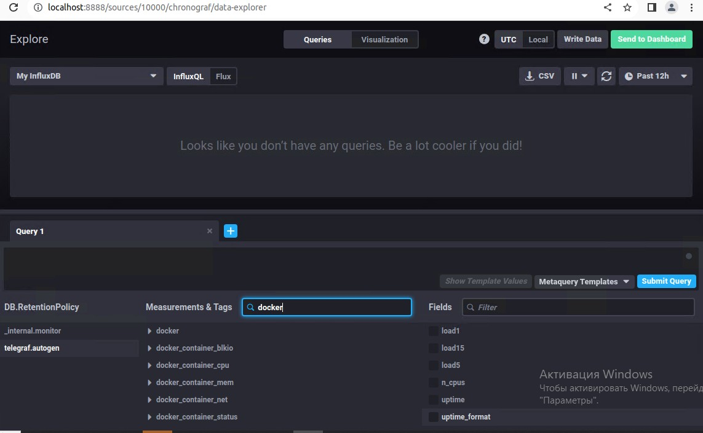

# Домашнее задание к занятию "13.Системы мониторинга"

## Обязательные задания

1. Вас пригласили настроить мониторинг на проект. На онбординге вам рассказали, что проект представляет из себя 
платформу для вычислений с выдачей текстовых отчетов, которые сохраняются на диск. Взаимодействие с платформой 
осуществляется по протоколу http. Также вам отметили, что вычисления загружают ЦПУ. Какой минимальный набор метрик вы
выведите в мониторинг и почему?

```
Метрики загрузки CPU, RAM, IOPS - помогут выявить пролблемы с инфраструкторой;
Количество inode - т.к. отчеты хранятся на диске;
Другие метрики HDD: объем свободного пространства, количество операций в секунду на запись/чтение - помогут выявить проблемы с жесткими дисками системы;
Метрики входящей/исходящей сетевой нагрузки;
HTTP метрики: количество HTTP запросов, количество ошибок 4хх/5хх, количество положительных ответов 2хх/3хх, время отклика сервиса на запрос, время выполнения HTTP-запроса, время создания отчета

```
#
2. Менеджер продукта посмотрев на ваши метрики сказал, что ему непонятно что такое RAM/inodes/CPUla. Также он сказал, 
что хочет понимать, насколько мы выполняем свои обязанности перед клиентами и какое качество обслуживания. Что вы 
можете ему предложить?

```
CPUla - средние значения загрузки процессора за 1, 5, и 15 минут. Значение не должно превышать n, где n - количество ядер.
inodes - индексные дескрипторы файловой системы. Имеют ограниченное количество почти во всех файловых системах. Количество свободных не должно быть, к примеру, меньше 10% от общего количества.
RAM - Оперативная память. Количество свободной не должно превышать 85% от доступного объёма.

По данному вопросу можно предложить разработать SLA, SLO и SLI: количество 400х и 500х ошибок, время реагирования на эти ошибки и их исправление.
А с помощью полученных метрик можно показать общее состояние системы и ее загрузку, показать время доступности системы, количество ошибок по типам 4хх/5хх, количество 2хх ответов сервисов.
```

#
3. Вашей DevOps команде в этом году не выделили финансирование на построение системы сбора логов. Разработчики в свою 
очередь хотят видеть все ошибки, которые выдают их приложения. Какое решение вы можете предпринять в этой ситуации, 
чтобы разработчики получали ошибки приложения?

```
1.сомописный скрипт сбора логов
2.В первую очередь, важно отметить агенты, которые доступны в большинстве Linux-дистрибутивов: rsyslog; syslog-ng. Когда число администрируемых хостов не является большим, то вполне хватит syslog-ng в качестве централизованного хранилища для файлов логов (сообщения будут приниматься на 514 UDP-порт). Также syslog-ng может раскладывать сообщения по директориям в учетом источника (FQDN/IP-адреса, даты, сервиса и пр.).
3. ELK: Стек продуктов Elasticsearch, Logstash, Kibana - требуется очень много ресурсов и умение настривать Graylog - решение работает из коробки, нужны минимальные настройки Octopussy — опенсорсное решение для работы с логами.
4. Vector, ClickHouse,LightHouse, Tabix - тоже стали актуальные и мощные оперсорсные решения для сбора и работы с логами
```
#
4. Вы, как опытный SRE, сделали мониторинг, куда вывели отображения выполнения SLA=99% по http кодам ответов. 
Вычисляете этот параметр по следующей формуле: summ_2xx_requests/summ_all_requests. Данный параметр не поднимается выше 
70%, но при этом в вашей системе нет кодов ответа 5xx и 4xx. Где у вас ошибка?

```
Формула не учитывает 3xx-ответы. Правильная будет:
SLI = (summ_2xx_requests + summ_3xx_requests) / summ_all_requests
```
#
5. Опишите основные плюсы и минусы pull и push систем мониторинга.

```
Относительные плюсы и минусы:

Время жизни приложения: если приложение долгоживущее, то можно использовать оба подхода, а если короткоживущее, то тут только Push модели.

Связность приложения и сервиса метрик: в случае Pull модели приложение и сервис метрик связаны минимально: приложение экспортирует произвольные метрики, система мониторинга их пуллит и сохраняет. Вопрос сбора метрик решается полностью за пределами программы. А в Push модели приложение должно знать куда отправлять метрики, иметь авторизационные ключи и так далее. При этом система мониторинга знает какие метрики будут поступать.

Доступность сервера снаружи: Для Pull модели система мониторинга должна иметь возможность “достучаться” до приложения. Если оно за NATом, то использовать Pull становится сложно, ведь нужно как-то прокидывать порт. У Push модели ситуация обратная и от этого более простая: достаточно добиться доступности центральной ноды с приложений.

Безопасность: Для Pull желательно установить реверс-прокси, вроде nginx, чтобы запросы не шли напрямую в приложение, закрыть порт nginx хоста в файрволле для всех, кроме сервера мониторинга, настроить экспортёр так, чтобы его порт прослушивался только на 127.0.0.1 (если вы используете реверс-прокси). У Push модели всё проще и от этого безопаснее: главное, защитить центральную ноду так, чтобы только приложения могли к ней пробиться.

Обнаружение недоступности ноды: у Pull модели максимально быстро узнаёте о недоступности, и у вас есть конкретные симптомы: соединение рвётся, таймаутит или nginx отдаёт 5XX ошибку, у Push модели придётся немного покопаться и выяснить конкретную причину: упал агент, весь сервер, неполадки с сетью или приложение вообще переехало.

Централизованная настройка: У Pull модели все настройки хранятся на центральном сервере. У Push модели, как правило, данные о необходимых метриках раздаются с центральной ноды. Также, вам необходимо позаботиться о том, как доставить авторизационные ключи и настройки подключения в конфиги агентов.

Масштабирование: у Pull модели стратегия сводится к установке всё более мощной центральной ноды, а когда дальнейший апгрейд становится неэффективным, то применяют горизонтальное масштабирование. Например, у Prometheus есть механизм federation , когда одна нода может стянуть данные с другой. У Push модели агенты по определению распределены по нодам, и обычно нагрузка на центральную ноду всё равно меньше, чем при пуллинге. Но если мощностей перестаёт хватать, то у Zabbix, например, есть прокси для горизонтального масштабирования.

```


#
6. Какие из ниже перечисленных систем относятся к push модели, а какие к pull? А может есть гибридные?

    - Prometheus       - Pull
    - TICK             - Push
    - Zabbix           - Push/Pull
    - VictoriaMetrics  - Push/Pull
    - Nagios           - Pull
#
7. Склонируйте себе [репозиторий](https://github.com/influxdata/sandbox/tree/master) и запустите TICK-стэк, 
используя технологии docker и docker-compose.

В виде решения на это упражнение приведите скриншот веб-интерфейса ПО chronograf (`http://localhost:8888`). 



P.S.: если при запуске некоторые контейнеры будут падать с ошибкой - проставьте им режим `Z`, например
`./data:/var/lib:Z`
#
8. Перейдите в веб-интерфейс Chronograf (http://localhost:8888) и откройте вкладку Data explorer.
        
    - Нажмите на кнопку Add a query
    - Изучите вывод интерфейса и выберите БД telegraf.autogen
    - В `measurments` выберите cpu->host->telegraf-getting-started, а в `fields` выберите usage_system. Внизу появится график утилизации cpu.
    - Вверху вы можете увидеть запрос, аналогичный SQL-синтаксису. Поэкспериментируйте с запросом, попробуйте изменить группировку и интервал наблюдений.

Для выполнения задания приведите скриншот с отображением метрик утилизации cpu из веб-интерфейса.



#
9. Изучите список [telegraf inputs](https://github.com/influxdata/telegraf/tree/master/plugins/inputs). 
Добавьте в конфигурацию telegraf следующий плагин - [docker](https://github.com/influxdata/telegraf/tree/master/plugins/inputs/docker):
```
[[inputs.docker]]
  endpoint = "unix:///var/run/docker.sock"
```

Дополнительно вам может потребоваться донастройка контейнера telegraf в `docker-compose.yml` дополнительного volume и 
режима privileged:
```
  telegraf:
    image: telegraf:1.4.0
    privileged: true
    volumes:
      - ./etc/telegraf.conf:/etc/telegraf/telegraf.conf:Z
      - /var/run/docker.sock:/var/run/docker.sock:Z
    links:
      - influxdb
    ports:
      - "8092:8092/udp"
      - "8094:8094"
      - "8125:8125/udp"
```

После настройке перезапустите telegraf, обновите веб интерфейс и приведите скриншотом список `measurments` в 
веб-интерфейсе базы telegraf.autogen . Там должны появиться метрики, связанные с docker.



Факультативно можете изучить какие метрики собирает telegraf после выполнения данного задания.

## Дополнительное задание (со звездочкой*) - необязательно к выполнению

1. Вы устроились на работу в стартап. На данный момент у вас нет возможности развернуть полноценную систему 
мониторинга, и вы решили самостоятельно написать простой python3-скрипт для сбора основных метрик сервера. Вы, как 
опытный системный-администратор, знаете, что системная информация сервера лежит в директории `/proc`. 
Также, вы знаете, что в системе Linux есть  планировщик задач cron, который может запускать задачи по расписанию.

Суммировав все, вы спроектировали приложение, которое:
- является python3 скриптом
- собирает метрики из папки `/proc`
- складывает метрики в файл 'YY-MM-DD-awesome-monitoring.log' в директорию /var/log 
(YY - год, MM - месяц, DD - день)
- каждый сбор метрик складывается в виде json-строки, в виде:
  + timestamp (временная метка, int, unixtimestamp)
  + metric_1 (метрика 1)
  + metric_2 (метрика 2)
  
     ...
     
  + metric_N (метрика N)
  
- сбор метрик происходит каждую 1 минуту по cron-расписанию

Для успешного выполнения задания нужно привести:

а) работающий код python3-скрипта,

б) конфигурацию cron-расписания,

в) пример верно сформированного 'YY-MM-DD-awesome-monitoring.log', имеющий не менее 5 записей,

P.S.: количество собираемых метрик должно быть не менее 4-х.
P.P.S.: по желанию можно себя не ограничивать только сбором метрик из `/proc`.

2. В веб-интерфейсе откройте вкладку `Dashboards`. Попробуйте создать свой dashboard с отображением:

    - утилизации ЦПУ
    - количества использованного RAM
    - утилизации пространства на дисках
    - количество поднятых контейнеров
    - аптайм
    - ...
    - фантазируйте)
    
    ---

### Как оформить ДЗ?

Выполненное домашнее задание пришлите ссылкой на .md-файл в вашем репозитории.

---