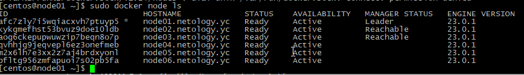
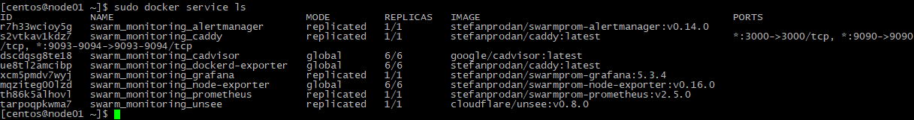
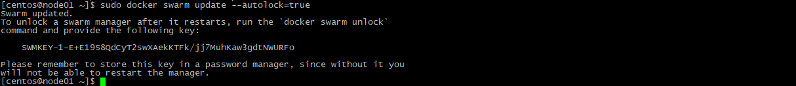

# Домашнее задание к занятию "5. Оркестрация кластером Docker контейнеров на примере Docker Swarm"

## Задача 1

Дайте письменые ответы на следующие вопросы:

- В чём отличие режимов работы сервисов в Docker Swarm кластере: replication и global?
```
Решение  - 
- replication - создает столько копий приложений\сервисов сколько мы укажем

- global - запускает сервис\приложение на всех нодах в кластере
```
- Какой алгоритм выбора лидера используется в Docker Swarm кластере?
```
Решение -  алгоритм RAFT
```
- Что такое Overlay Network?
```
Решение  - Сетевой драйвер создает распределенную сеть между несколькими Узлы демонов Docker. Эта сеть находится поверх (накладывается) на конкретный хост сети, позволяющие подключать к нему контейнеры (включая роевой сервис) containers) для безопасного взаимодействия при включенном шифровании. Докер прозрачно обрабатывает маршрутизацию каждого пакета в и из правильного Docker Узел демона и правильный контейнер назначения
```

## Задача 2

Создать ваш первый Docker Swarm кластер в Яндекс.Облаке

Для получения зачета, вам необходимо предоставить скриншот из терминала (консоли), с выводом команды:
```
docker node ls
```
Решение  - 


## Задача 3

Создать ваш первый, готовый к боевой эксплуатации кластер мониторинга, состоящий из стека микросервисов.

Для получения зачета, вам необходимо предоставить скриншот из терминала (консоли), с выводом команды:
```
docker service ls
```
Решение  - 

## Задача 4 (*)

Выполнить на лидере Docker Swarm кластера команду (указанную ниже) и дать письменное описание её функционала, что она делает и зачем она нужна:
```
# см.документацию: https://docs.docker.com/engine/swarm/swarm_manager_locking/
docker swarm update --autolock=true
```


```
включает блокировку 
после перезагрузки, для разболокировки нужно вводить ключ, также доступ к логам 

```
Решение  - 