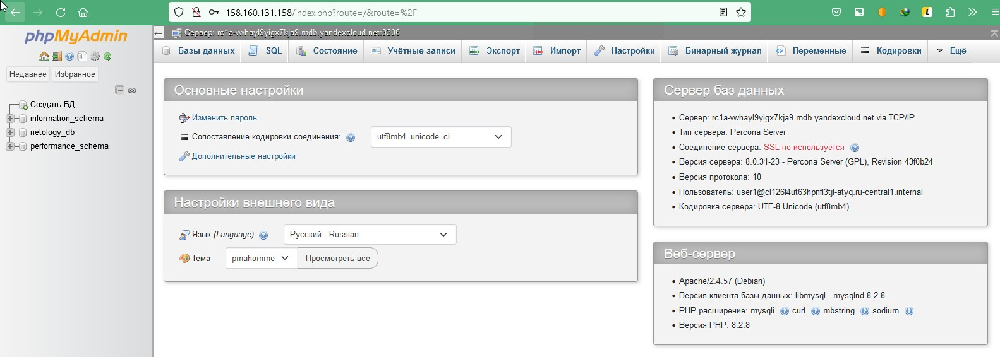

# Домашнее задание к занятию «Кластеры. Ресурсы под управлением облачных провайдеров»

### Цели задания 

1. Организация кластера Kubernetes и кластера баз данных MySQL в отказоустойчивой архитектуре.
2. Размещение в private подсетях кластера БД, а в public — кластера Kubernetes.

---
## Задание 1. Yandex Cloud

1. Настроить с помощью Terraform кластер баз данных MySQL.

 - Используя настройки VPC из предыдущих домашних заданий, добавить дополнительно подсеть private в разных зонах, чтобы обеспечить отказоустойчивость. 
 - Разместить ноды кластера MySQL в разных подсетях.
 - Необходимо предусмотреть репликацию с произвольным временем технического обслуживания.
 - Использовать окружение Prestable, платформу Intel Broadwell с производительностью 50% CPU и размером диска 20 Гб.
 - Задать время начала резервного копирования — 23:59.
 - Включить защиту кластера от непреднамеренного удаления.
 - Создать БД с именем `netology_db`, логином и паролем.

2. Настроить с помощью Terraform кластер Kubernetes.

 - Используя настройки VPC из предыдущих домашних заданий, добавить дополнительно две подсети public в разных зонах, чтобы обеспечить отказоустойчивость.
 - Создать отдельный сервис-аккаунт с необходимыми правами. 
 - Создать региональный мастер Kubernetes с размещением нод в трёх разных подсетях.
 - Добавить возможность шифрования ключом из KMS, созданным в предыдущем домашнем задании.
 - Создать группу узлов, состояющую из трёх машин с автомасштабированием до шести.
 - Подключиться к кластеру с помощью `kubectl`.
 - *Запустить микросервис phpmyadmin и подключиться к ранее созданной БД.
 - *Создать сервис-типы Load Balancer и подключиться к phpmyadmin. Предоставить скриншот с публичным адресом и подключением к БД.

Полезные документы:

- [MySQL cluster](https://registry.terraform.io/providers/yandex-cloud/yandex/latest/docs/resources/mdb_mysql_cluster).
- [Создание кластера Kubernetes](https://cloud.yandex.ru/docs/managed-kubernetes/operations/kubernetes-cluster/kubernetes-cluster-create)
- [K8S Cluster](https://registry.terraform.io/providers/yandex-cloud/yandex/latest/docs/resources/kubernetes_cluster).
- [K8S node group](https://registry.terraform.io/providers/yandex-cloud/yandex/latest/docs/resources/kubernetes_node_group).


# Решение:

[Terraform](./15.4/terraform)

```bash
# поднимаем инфраструктуру
➜  terraform git:(main) ✗ ./start.sh
....

Outputs:

connection_current_master = "c-c9q3bgd9t8af7c7eh31a.rw.mdb.yandexcloud.net"
connection_nodes = tolist([
  "rc1a-vwhayl9yigx7kja9.mdb.yandexcloud.net",
  "rc1c-wxjielt40hbf3828.mdb.yandexcloud.net",
  "rc1b-0se8uazwgn9d2uy1.mdb.yandexcloud.net",
])
k8s_cluster_id = "catcusee7i63m054ilrj"
k8s_external_v4_endpoint = "https://158.160.128.34"

# получаем к себе конфиг k8s кластера
➜  terraform git:(main) ✗ yc managed-kubernetes cluster get-credentials --id catcusee7i63m054ilrj --external

Context 'yc-k8s-regional' was added as default to kubeconfig '/home/vit/.kube/config'.
Check connection to cluster using 'kubectl cluster-info --kubeconfig /home/vit/.kube/config'.

# деплоим приложение и сервис myphpadmin и смотрим IP адрес службы (Loadbalancer)
➜  terraform git:(main) ✗ k apply -f myphp.yaml 
deployment.apps/phpmyadmin-deployment created
service/phpmyadmin-service created
➜  terraform git:(main) ✗ k get svc -o wide
NAME                 TYPE           CLUSTER-IP     EXTERNAL-IP       PORT(S)        AGE   SELECTOR
kubernetes           ClusterIP      10.96.128.1    <none>            443/TCP        11m   <none>
phpmyadmin-service   LoadBalancer   10.96.240.10   158.160.131.158   80:31658/TCP   39s   app=phpmyadmin

## переходим в браузер по полученному IP для phpmyadmin
```



--- 
## Задание 2*. Вариант с AWS (задание со звёздочкой)

Это необязательное задание. Его выполнение не влияет на получение зачёта по домашней работе.

**Что нужно сделать**

1. Настроить с помощью Terraform кластер EKS в три AZ региона, а также RDS на базе MySQL с поддержкой MultiAZ для репликации и создать два readreplica для работы.
 
 - Создать кластер RDS на базе MySQL.
 - Разместить в Private subnet и обеспечить доступ из public сети c помощью security group.
 - Настроить backup в семь дней и MultiAZ для обеспечения отказоустойчивости.
 - Настроить Read prelica в количестве двух штук на два AZ.

2. Создать кластер EKS на базе EC2.

 - С помощью Terraform установить кластер EKS на трёх EC2-инстансах в VPC в public сети.
 - Обеспечить доступ до БД RDS в private сети.
 - С помощью kubectl установить и запустить контейнер с phpmyadmin (образ взять из docker hub) и проверить подключение к БД RDS.
 - Подключить ELB (на выбор) к приложению, предоставить скрин.

Полезные документы:

- [Модуль EKS](https://learn.hashicorp.com/tutorials/terraform/eks).

### Правила приёма работы

Домашняя работа оформляется в своём Git репозитории в файле README.md. Выполненное домашнее задание пришлите ссылкой на .md-файл в вашем репозитории.
Файл README.md должен содержать скриншоты вывода необходимых команд, а также скриншоты результатов.
Репозиторий должен содержать тексты манифестов или ссылки на них в файле README.md.
